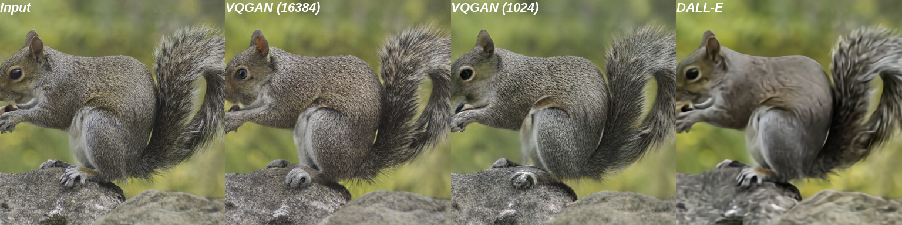

# Taming Transformers for High-Resolution Image Synthesis


[**Taming Transformers for High-Resolution Image Synthesis**](https://compvis.github.io/taming-transformers/)<br/>
[Patrick Esser](https://github.com/pesser)\*,
[Robin Rombach](https://github.com/rromb)\*,
[Björn Ommer](https://hci.iwr.uni-heidelberg.de/Staff/bommer)<br/>
\* equal contribution

**tl;dr** We combine the efficiancy of convolutional approaches with the expressivity of transformers by introducing a convolutional VQGAN, which learns a codebook of context-rich visual parts, whose composition is modeled with an autoregressive transformer.


[arXiv](https://arxiv.org/abs/2012.09841) | [BibTeX](#bibtex) | [Project Page](https://compvis.github.io/taming-transformers/)

### News
- We added a [colab notebook](TODO) which compares two VQGANs and OpenAI's [DALL-E](). See also [this section](##more-resources).
- We now include an overview of pretrained models in [Tab.1](#overview-of-pretrained-models)
- The streamlit demo now supports image completions.
- We now include a couple of examples from the D-RIN dataset so you can run the
  [D-RIN demo](#d-rin) without preparing the dataset first.
- You can now jump right into sampling with our [Colab quickstart notebook](https://colab.research.google.com/github/CompVis/taming-transformers/blob/master/scripts/taming-transformers.ipynb).

## Requirements
A suitable [conda](https://conda.io/) environment named `taming` can be created
and activated with:

```
conda env create -f environment.yaml
conda activate taming
```
## Overview of pretrained models
The following table provides an overview of all models that are currently available. 
FID scores were evaluated using [torch-fidelity](https://github.com/toshas/torch-fidelity) and without rejection sampling.
For reference, we also include a link to the recently released autoencoder of the [DALL-E]() model. 
See the corresponding [colab notebook](todo) for a comparison and discussion of reconstruction capabilities.

| Dataset  | FID | Link |  Samples (256x256) | Comments
| ------------- | ------------- |-------------  | -------------  |-------------  |
| FFHQ (f=16) | 11.4 | coming soon... | 
| CelebA-HQ (f=16) | 10.7 | coming soon... | 
| ADE20K (f=16) | 35.5  | [ade20k_transformer](https://k00.fr/ot46cksa) | [ade20k_samples.zip](https://heibox.uni-heidelberg.de/f/70bb78cbaf844501b8fb/) [2k]
| COCO-Stuff (f=16) | 20.4  | [coco_transformer](https://k00.fr/2zz6i2ce) | [coco_samples.zip](https://heibox.uni-heidelberg.de/f/a395a9be612f4a7a8054/) [5k]
| ImageNet (cIN) (f=16) |  | coming soon...
| |  | | || |
| FacesHQ (f=16) | -- | [faceshq_transformer](https://k00.fr/qqfl2do8)
| S-FLCKR (f=16) | -- | [sflckr](https://heibox.uni-heidelberg.de/d/73487ab6e5314cb5adba/) 
| D-RIN (f=16) | -- | [drin_transformer](https://k00.fr/39jcugc5)
| |  | | || |
| VQGAN ImageNet (f=16), 1024| 8.0 | [vqgan_imagenet_f16_1024](https://heibox.uni-heidelberg.de/d/8088892a516d4e3baf92/) | TODO | Reconstruction-FIDs evaluated against the validation split of ImageNet on 256x256 images. Check out the [colab notebook](https://colab.research.google.com/github/CompVis/taming-transformers/blob/master/scripts/reconstruction_usage.ipynb)
| VQGAN ImageNet (f=16), 16384| 4.9 |[vqgan_imagenet_f16_16384](https://heibox.uni-heidelberg.de/d/a7530b09fed84f80a887/)  |  TODO | Reconstruction-FIDs evaluated against the validation split of ImageNet on 256x256 images. Check out the [colab notebook](https://colab.research.google.com/github/CompVis/taming-transformers/blob/master/scripts/reconstruction_usage.ipynb)
| |  | | || |
| DALL-E VQVA (f=8), 8192, GumbelQuantization| 34.3 | https://github.com/openai/DALL-E | TODO | Reconstruction-FIDs evaluated against the validation split of ImageNet on 256x256 images. Check out the [colab notebook](https://colab.research.google.com/github/CompVis/taming-transformers/blob/master/scripts/reconstruction_usage.ipynb)


## Running pretrained models

The commands below will start a streamlit demo which supports sampling at
different resolutions and image completions. To run a non-interactive version
of the sampling process, replace `streamlit run scripts/sample_conditional.py --`
by `python scripts/make_samples.py --outdir <path_to_write_samples_to>` and
keep the remaining command line arguments.

### S-FLCKR


You can also [run this model in a Colab
notebook](https://colab.research.google.com/github/CompVis/taming-transformers/blob/master/scripts/taming-transformers.ipynb),
which includes all necessary steps to start sampling.

Download the
[2020-11-09T13-31-51_sflckr](https://heibox.uni-heidelberg.de/d/73487ab6e5314cb5adba/)
folder and place it into `logs`. Then, run
```
streamlit run scripts/sample_conditional.py -- -r logs/2020-11-09T13-31-51_sflckr/
```

### FacesHQ


Download [2020-11-13T21-41-45_faceshq_transformer](https://k00.fr/qqfl2do8) and
place it into `logs`. Follow the data preparation steps for
[CelebA-HQ](#celeba-hq) and [FFHQ](#ffhq). Run
```
streamlit run scripts/sample_conditional.py -- -r logs/2020-11-13T21-41-45_faceshq_transformer/
```

### D-RIN


Download [2020-11-20T12-54-32_drin_transformer](https://k00.fr/39jcugc5) and
place it into `logs`. To run the demo on a couple of example depth maps
included in the repository, run

```
streamlit run scripts/sample_conditional.py -- -r logs/2020-11-20T12-54-32_drin_transformer/ --ignore_base_data data="{target: main.DataModuleFromConfig, params: {batch_size: 1, validation: {target: taming.data.imagenet.DRINExamples}}}"
```

To run the demo on the complete validation set, first follow the data preparation steps for
[ImageNet](#imagenet) and then run
```
streamlit run scripts/sample_conditional.py -- -r logs/2020-11-20T12-54-32_drin_transformer/
```

### COCO
Download [2021-01-20T16-04-20_coco_transformer](https://k00.fr/2zz6i2ce) and
place it into `logs`. To run the demo on a couple of example segmentation maps
included in the repository, run

```
streamlit run scripts/sample_conditional.py -- -r logs/2021-01-20T16-04-20_coco_transformer/ --ignore_base_data data="{target: main.DataModuleFromConfig, params: {batch_size: 1, validation: {target: taming.data.coco.Examples}}}"
```

### ADE20k
Download [2020-11-20T21-45-44_ade20k_transformer](https://k00.fr/ot46cksa) and
place it into `logs`. To run the demo on a couple of example segmentation maps
included in the repository, run

```
streamlit run scripts/sample_conditional.py -- -r logs/2020-11-20T21-45-44_ade20k_transformer/ --ignore_base_data data="{target: main.DataModuleFromConfig, params: {batch_size: 1, validation: {target: taming.data.ade20k.Examples}}}"
```

## Data Preparation

### ImageNet
The code will try to download (through [Academic
Torrents](http://academictorrents.com/)) and prepare ImageNet the first time it
is used. However, since ImageNet is quite large, this requires a lot of disk
space and time. If you already have ImageNet on your disk, you can speed things
up by putting the data into
`${XDG_CACHE}/autoencoders/data/ILSVRC2012_{split}/data/` (which defaults to
`~/.cache/autoencoders/data/ILSVRC2012_{split}/data/`), where `{split}` is one
of `train`/`validation`. It should have the following structure:

```
${XDG_CACHE}/autoencoders/data/ILSVRC2012_{split}/data/
├── n01440764
│   ├── n01440764_10026.JPEG
│   ├── n01440764_10027.JPEG
│   ├── ...
├── n01443537
│   ├── n01443537_10007.JPEG
│   ├── n01443537_10014.JPEG
│   ├── ...
├── ...
```

If you haven't extracted the data, you can also place
`ILSVRC2012_img_train.tar`/`ILSVRC2012_img_val.tar` (or symlinks to them) into
`${XDG_CACHE}/autoencoders/data/ILSVRC2012_train/` /
`${XDG_CACHE}/autoencoders/data/ILSVRC2012_validation/`, which will then be
extracted into above structure without downloading it again.  Note that this
will only happen if neither a folder
`${XDG_CACHE}/autoencoders/data/ILSVRC2012_{split}/data/` nor a file
`${XDG_CACHE}/autoencoders/data/ILSVRC2012_{split}/.ready` exist. Remove them
if you want to force running the dataset preparation again.

You will then need to prepare the depth data using
[MiDaS](https://github.com/intel-isl/MiDaS). Create a symlink
`data/imagenet_depth` pointing to a folder with two subfolders `train` and
`val`, each mirroring the structure of the corresponding ImageNet folder
described above and containing a `png` file for each of ImageNet's `JPEG`
files. The `png` encodes `float32` depth values obtained from MiDaS as RGBA
images. We provide the script `scripts/extract_depth.py` to generate this data.
**Please note** that this script uses [MiDaS via PyTorch
Hub](https://pytorch.org/hub/intelisl_midas_v2/). When we prepared the data,
the hub provided the [MiDaS
v2.0](https://github.com/intel-isl/MiDaS/releases/tag/v2) version, but now it
provides a v2.1 version. We haven't tested our models with depth maps obtained
via v2.1 and if you want to make sure that things work as expected, you must
adjust the script to make sure it explicitly uses
[v2.0](https://github.com/intel-isl/MiDaS/releases/tag/v2)!

### CelebA-HQ
Create a symlink `data/celebahq` pointing to a folder containing the `.npy`
files of CelebA-HQ (instructions to obtain them can be found in the [PGGAN
repository](https://github.com/tkarras/progressive_growing_of_gans)).

### FFHQ
Create a symlink `data/ffhq` pointing to the `images1024x1024` folder obtained
from the [FFHQ repository](https://github.com/NVlabs/ffhq-dataset).

### S-FLCKR
Unfortunately, we are not allowed to distribute the images we collected for the
S-FLCKR dataset and can therefore only give a description how it was produced.
There are many resources on [collecting images from the
web](https://github.com/adrianmrit/flickrdatasets) to get started.
We collected sufficiently large images from [flickr](https://www.flickr.com)
(see `data/flickr_tags.txt` for a full list of tags used to find images)
and various [subreddits](https://www.reddit.com/r/sfwpornnetwork/wiki/network)
(see `data/subreddits.txt` for all subreddits that were used).
Overall, we collected 107625 images, and split them randomly into 96861
training images and 10764 validation images. We then obtained segmentation
masks for each image using [DeepLab v2](https://arxiv.org/abs/1606.00915)
trained on [COCO-Stuff](https://arxiv.org/abs/1612.03716). We used a [PyTorch
reimplementation](https://github.com/kazuto1011/deeplab-pytorch) and include an
example script for this process in `scripts/extract_segmentation.py`.

### COCO
Create a symlink `data/coco` containing the images from the 2017 split in
`train2017` and `val2017`, and their annotations in `annotations`. Files can be
obtained from the [COCO webpage](https://cocodataset.org/). In addition, we use
the [Stuff+thing PNG-style annotations on COCO 2017
trainval](http://calvin.inf.ed.ac.uk/wp-content/uploads/data/cocostuffdataset/stuffthingmaps_trainval2017.zip)
annotations from [COCO-Stuff](https://github.com/nightrome/cocostuff), which
should be placed under `data/cocostuffthings`.

### ADE20k
Create a symlink `data/ade20k_root` containing the contents of
[ADEChallengeData2016.zip](http://data.csail.mit.edu/places/ADEchallenge/ADEChallengeData2016.zip)
from the [MIT Scene Parsing Benchmark](http://sceneparsing.csail.mit.edu/).

## Training models

### FacesHQ

Train a VQGAN with
```
python main.py --base configs/faceshq_vqgan.yaml -t True --gpus 0,
```

Then, adjust the checkpoint path of the config key
`model.params.first_stage_config.params.ckpt_path` in
`configs/faceshq_transformer.yaml` (or download
[2020-11-09T13-33-36_faceshq_vqgan](https://k00.fr/uxy5usa9) and place into `logs`, which
corresponds to the preconfigured checkpoint path), then run
```
python main.py --base configs/faceshq_transformer.yaml -t True --gpus 0,
```

### D-RIN

Train a VQGAN on ImageNet with
```
python main.py --base configs/imagenet_vqgan.yaml -t True --gpus 0,
```

or download a pretrained one from [2020-09-23T17-56-33_imagenet_vqgan](https://k00.fr/u0j2dtac)
and place under `logs`. If you trained your own, adjust the path in the config
key `model.params.first_stage_config.params.ckpt_path` of
`configs/drin_transformer.yaml`.

Train a VQGAN on Depth Maps of ImageNet with
```
python main.py --base configs/imagenetdepth_vqgan.yaml -t True --gpus 0,
```

or download a pretrained one from [2020-11-03T15-34-24_imagenetdepth_vqgan](https://k00.fr/55rlxs6i)
and place under `logs`. If you trained your own, adjust the path in the config
key `model.params.cond_stage_config.params.ckpt_path` of
`configs/drin_transformer.yaml`.

To train the transformer, run
```
python main.py --base configs/drin_transformer.yaml -t True --gpus 0,
```

## More Resources
### Comparing Different First Stage Models
The reconstruction and compression capabilities of different fist stage models can be analyzed in this [colab notebook](https://colab.research.google.com/github/CompVis/taming-transformers/blob/master/scripts/reconstruction_usage.ipynb). 
In particular, the notebook compares two VQGANs (with a downsampling factor of f=16 for each and codebook dimensionality of 1024 and 16384) and 
the discrete autoencoder of OpenAI's [DALL-E](https://github.com/openai/DALL-E) (which has f=8).


### Other
- A [video summary](https://www.youtube.com/watch?v=o7dqGcLDf0A&feature=emb_imp_woyt) by [Two Minute Papers](https://www.youtube.com/channel/UCbfYPyITQ-7l4upoX8nvctg).
- A [weights and biases report summarizing the paper](https://wandb.ai/ayush-thakur/taming-transformer/reports/-Overview-Taming-Transformers-for-High-Resolution-Image-Synthesis---Vmlldzo0NjEyMTY)
by [ayulockin](https://github.com/ayulockin).
- A [video summary](https://www.youtube.com/watch?v=JfUTd8fjtX8&feature=emb_imp_woyt) by [What's AI](https://www.youtube.com/channel/UCUzGQrN-lyyc0BWTYoJM_Sg).
- Take a look at [ak9250's notebook](https://github.com/ak9250/taming-transformers/blob/master/tamingtransformerscolab.ipynb) if you want to run the streamlit demos on Colab.

## Shout-outs
Thanks to everyone who makes their code and models available. In particular,

- The architecture of our VQGAN is inspired by [Denoising Diffusion Probabilistic Models](https://github.com/hojonathanho/diffusion)
- The very hackable transformer implementation [minGPT](https://github.com/karpathy/minGPT)
- The good ol' [PatchGAN](https://github.com/junyanz/pytorch-CycleGAN-and-pix2pix) and [Learned Perceptual Similarity (LPIPS)](https://github.com/richzhang/PerceptualSimilarity)

## BibTeX

```
@misc{esser2020taming,
      title={Taming Transformers for High-Resolution Image Synthesis}, 
      author={Patrick Esser and Robin Rombach and Björn Ommer},
      year={2020},
      eprint={2012.09841},
      archivePrefix={arXiv},
      primaryClass={cs.CV}
}
```
